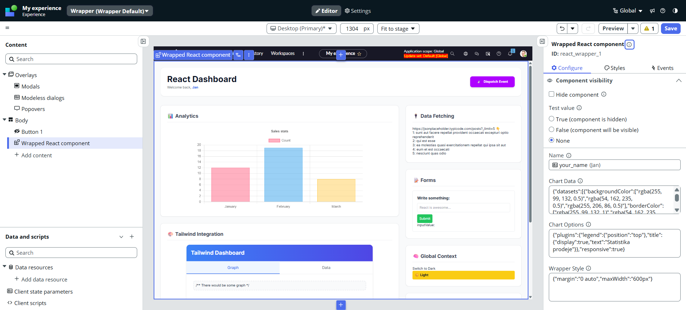

# ServiceNow UI Builder React Wrapper (Golden Stack 🏆)


This project serves as a robust, production-ready template for integrating **React (v17)** and **Tailwind CSS** within the **ServiceNow UI Builder**.

It addresses the specific build constraints of the ServiceNow CLI, ensures seamless communication between the Shadow DOM and the platform, and provides a modern Developer Experience (DX).

<br>

<div align="center">
  
</div>

<br>

---
## 📋 Prerequisites

Before you clone the repository, ensure you have the following installed and configured:

1.  **Node.js & npm**
    * Recommended: **Node v20** or **v22**.

2.  **ServiceNow CLI (`snc`)**
    * You must have the CLI installed and authorized to your instance.
    * [Official Installation Guide](https://www.servicenow.com/docs/bundle/zurich-application-development/page/build/servicenow-cli/task/download-cli.html)

3.  **UI Component Extension**
    * The core CLI is not enough; you need the component extension.
    * Run: `snc extension add --name ui-component`
    * [Official Setup Guide](https://www.servicenow.com/docs/bundle/xanadu-application-development/page/build/components/concept/custom-components.html)

4.  **A ServiceNow Instance**
    * Targeting **Zurich** or newer.

## 🚀 Development

Use a unified command to handle both the ServiceNow server and the Tailwind JIT compiler simultaneously.

1. **Install Dependencies:**
   ```bash
   npm install
   ```

2. **Start Development:**
   ```bash
   npm start
   ```
   * This command runs `concurrently`:
       * **Tailwind Watcher:** Monitors `.js/.jsx` files and recompiles CSS instantly.
       * **ServiceNow Server:** Serves the widget locally with Hot Reload.

## ⚙️ Setup: Changing Vendor Prefix

The project is currently configured with a demo vendor prefix (`x-513106`). **Before deploying**, you must update the vendor prefix and scope name to match your environment.

**Example Scenario:**
* **Current Prefix:** `x-513106`
* **Your Prefix:** `x-999999` (Check sys_property `glide.appcreator.company.code`)

### ⚡ Option 1: The Quick Way (VS Code)

1.  **Rename the component folder:**
    * Rename `src/x-513106-ui-framework-react-wrapper` to `src/x-999999-ui-framework-react-wrapper`.
2.  **Global Find & Replace:**
    * Open "Search" in VS Code (`Ctrl+Shift+F`).
    * Search for: `x-513106`
    * Replace with: `x-999999`
    * *Note: This handles file imports, tag names, and the config key.*
3.  **Update Scope Name (Underscores):**
    * Search for: `x_513106`
    * Replace with: `x_999999`
    * *Note: This updates the `scopeName` in `now-ui.json`.*

### 🛠 Option 2: Step-by-Step Manual Configuration

If you prefer to make changes manually to ensure precision, follow these steps:

#### 1. Update `now-ui.json`
Locate the `now-ui.json` file in the root directory.
* **Component Key:** Change the property key inside `components` from `x-513106-ui-framework-react-wrapper` to `x-999999-ui-framework-react-wrapper`.
* **Scope Name:** Change `"scopeName": "x_513106_ufrw"` to `"scopeName": "x_999999_ufrw"`.

#### 2. Rename Component Source Folder
* Navigate to the `src` folder.
* Rename the folder `x-513106-ui-framework-react-wrapper` to `x-999999-ui-framework-react-wrapper`.

#### 3. Update Root Component Registration
* Open `src/x-999999-ui-framework-react-wrapper/index.js`.
* Update the `createCustomElement` call:
    ```javascript
    createCustomElement('x-999999-ui-framework-react-wrapper', ...
    ```

#### 4. Update Entry Point
* Open `src/index.js`.
* Update the import path:
    ```javascript
    import './x-999999-ui-framework-react-wrapper';
    ```

#### 5. Update Local Development Example
* Open `example/element.js`.
* Update the import and the HTML tag:
    ```javascript
    import '../src/x-999999-ui-framework-react-wrapper';

    const el = document.createElement('DIV');
    document.body.appendChild(el);

    el.innerHTML = `
        <x-999999-ui-framework-react-wrapper></x-999999-ui-framework-react-wrapper>
    `;
    ```

## 📦 Deployment

Once you have updated the vendor prefix, you can deploy to your instance.
Due to strict version requirements, always perform a **clean install** if you encounter build errors.

1. `rm -rf node_modules package-lock.json`
2. `npm install`
3. `snc ui-component deploy --profile <profile> --force`

## 🛠 Architecture Overview

The core philosophy is isolation and compatibility.

#### 1. The Gate (`index.js`)
* **The Gatekeeper:** The only file that communicates directly with the ServiceNow `createCustomElement` API.
* **Shadow DOM Manager:** It manually injects the compiled Tailwind CSS + SCSS styles into the Shadow Root to ensure proper styling.
* **Event Retargeting:** Implements manual event retargeting logic. Since React events (like `onClick`) struggle to bubble out of Shadow DOM, this layer fixes the event path.
* **Error Boundary:** Acts as a safety net. If the React application crashes, the Gate catches the error and displays a fallback UI instead of breaking the entire UI Builder page.

#### 2. The Bridge (`ReactBridge.js`)
* **The Translator:** Decouples the UI Framework from the React Application.
* **Prop Normalization:** Receives raw properties from ServiceNow and transforms them into clean props for the React app.
* **Action Handling:** It defines the specific callback functions. The React App calls `onAction(data)`, and the Bridge translates this into a specific ServiceNow `dispatch('EVENT_NAME', data)` call.

#### 3. The React App (`components/MyReactApp.js`)
* **Pure React 17:** A standard React application that knows nothing about ServiceNow, `snc`, or Shadow DOM.
* **Reusable:** Because it is isolated, this component could theoretically be moved to a standard web app and would still work (just by replacing the Bridge).
* **State Management:** Uses standard hooks (`useState`, `useEffect`) and **Context API** (`ThemeProvider`) to demonstrate robust state management across the component tree.

## 🧱 The Immutable Core (Must Read)

To ensure the stability of the bridge between ServiceNow and React, the architecture relies on **three mandatory layers** that should remain structurally unchanged.

Think of this as an "Onion Architecture":

```text
[ UI Builder ]
        ⬇ (Props)                     ⬆ (Events)
-------------------------------------------------------
1. 🛡️ UI Framework Wrapper (index.js)          
      | Communicates with UI Builder
      | Uses Snabbdom Renderer
      | Handles Shadow DOM & Style Injection
-------------------------------------------------------
        ⬇ (UI Framework props)        ⬆ (Dispatch)
-------------------------------------------------------
2. 🚪 Root React Component (ReactBridge.js)    
      | Communicates with UI Framework Wrapper
      | Receives 'dispatch' & 'properties' 
      | Communicates with other React components 
-------------------------------------------------------
        ⬇ (Your props)                ⬆ (Callbacks)
-------------------------------------------------------
3. ✨ Developer Land (Your Components)       
      | Pure React World 
      | Hooks, State, Effects, Routing...
-------------------------------------------------------
```

## 📡 Generic Event Dispatching System

You **do not** need to modify `index.js` to add new events. The React application receives a universal `dispatch` function via props.

#### Workflow: Adding a New Event

1. **React Component:**
    ```javascript
    const handleHover = (data) => {
        // Just call dispatch with any event name
        props.dispatch('CHART_HOVER', { id: data.id });
    };
    ```

2. **ServiceNow Config (`now-ui.json`):**
    ```json
    "actions": [
      {
        "name": "CHART_HOVER",
        "label": "On Chart Hover",
        "description": "Fires when user hovers over a chart",
        "payload": [{ "name": "id", "label": "ID" }]
      }
    ]
    ```

3. **Result:** The event appears in UI Builder's "Events" tab automatically.

## 🛄 Properties

#### Workflow: Adding a New Input (Property)

To pass data FROM ServiceNow TO React:

1. **ServiceNow Config (`now-ui.json`):**
    ```json
    "properties": [
      {
        "name": "reportTitle",
        "fieldType": "string",
        "default": "My Report"
      }
    ]
    ```

2. **React Component:**
    The property is automatically available in `MyReactApp` props.
    ```javascript
    // MyReactApp.js
    export const MyReactApp = ({ reportTitle, dispatch }) => {
        return <h1>{reportTitle}</h1>;
    };
    ```
## ⚙️ Critical Configuration

For this wrapper to build successfully, these configurations are mandatory (already included):

1. **Babel Patch:** Enforces "classic" JSX runtime (ServiceNow Webpack limitation).
2. **Tailwind Config:** Configured to scan `./src/**/*.{js,jsx}` for JIT generation.
3. **NPM Scripts:** Utilizes `concurrently` for a smooth dev experience.

---

## ⚠️ React 17 vs. React 18 Limitations

This project uses **React 17** for maximum stability with the ServiceNow build system.
* ❌ No Concurrent Mode (`useTransition`).
* ❌ No Automatic Batching in async/timeouts.
* ❌ Uses `ReactDOM.render()` instead of `createRoot()`.

_Note: For 99% of standard UI components (dashboards, forms, charts), React 17 is perfectly sufficient._

## 🚫 Library Compatibility (The "Golden Stack" Rule)

⚠️ **CRITICAL WARNING:** This environment is extremely sensitive to 3rd party dependencies due to:
1.  **Shadow DOM Isolation:** Blocks global styles.
2.  **Legacy Build System:** The internal Webpack config often fails to compile modern libraries using CSS-in-JS engines or complex ESM exports.

## ❌ What is confirmed to FAIL:
Do not install these libraries, as they break the build or render incorrectly:
* **Material UI (MUI v5/v6)** - Build fails (Emotion dependency).
* **Chakra UI** - Build fails (Emotion dependency).
* **Ant Design** - Global styles do not penetrate Shadow DOM.
* **Bootstrap (JS/CSS)** - Relies on global CSS.

## ✅ What is confirmed to WORK (The Golden Stack):
The only 100% guaranteed approach is to build components yourself using standard React and Tailwind CSS.

* **Layouts/Buttons/Cards:** Build them as pure React components. Style them with Tailwind utility classes.
* **Logic:** Use standard React Hooks (`useState`, `useEffect`).
* **Charts:** `Chart.js` / `react-chartjs-2` (Verified).
* **Data Fetching:** Native `fetch` or `axios`.

#### 🧪 Experimental (Use at your own risk):
"Headless" libraries (like *Radix UI*, *Headless UI*, or *React Aria*) theoretically **should** work better because they don't rely on CSS-in-JS engines. However, **they have NOT been verified** in this specific wrapper build chain.

> **Recommendation:** If you need complex UI (like a Datepicker or Combobox), try to find a lightweight, zero-dependency implementation or build a custom one. If you decide to try a library, install and deploy it immediately to verify compatibility before building features on top of it.

## 🎨 Styling with Tailwind CSS

Unlike traditional setups, we **do not** use a CDN. Instead, we compile Tailwind CSS directly into the component to ensure **Shadow DOM isolation** (styles do not bleed out, global styles do not bleed in).

#### How it works
1. **Source:** `src/tailwind-input.css` (Entry point for Tailwind directives and custom CSS).
2. **Build:** The watcher compiles your React usage into `src/tailwind-generated.scss`.
3. **Injection:** `index.js` injects the generated string into the component's Shadow Root `<style>` tag.

#### How to add styles?
* **Utility Classes:** Just use them in JSX: `<div className="p-4 bg-blue-500 hover:opacity-50">`. The watcher detects them and generates the CSS automatically.
* **Custom CSS:** If you need specific styles (fonts, animations) that Tailwind can't handle, add them to `src/tailwind-input.css` inside the `@layer` directive:
    ```css
    @layer components {
      .my-custom-btn {
        background-color: red !important;
      }
    }
    ```

## 🧩 Modals & Popups (Architecture Decision)

This project includes a technically functional `MyReactModal` component that uses **React Portals** to break out of the Shadow DOM and render into `document.body` (while maintaining style isolation via a nested Shadow Root).

### ⚠️ Recommendation: Use UI Builder Modals
While the React Modal implementation proves it *can* be done, **the recommended best practice is:**

1. **React:** Dispatch an event (e.g., `OPEN_MODAL_REQUESTED`).
2. **UI Builder:** Handle the event and open a **native ServiceNow Modal**.

**Why?**
* Consistency with the rest of the platform UI.
* Better Accessibility (a11y) support out-of-the-box.
* Less code to maintain within the custom widget.

## ☕ Support the Project

This wrapper was born out of frustration and countless hours of fighting the ServiceNow build system.

If this template saved you time, headache, or prevented a nervous breakdown while fighting the Shadow DOM, consider buying me a coffee. It keeps the motivation high!

[](https://buymeacoffee.com/janmoser)

## 🤝 Contributing

Feel free to fork it, break it, and fix it. If you find a way to make Material UI work or have any other improvements, pull requests are more than welcome.

## 📄 License

This project is licensed under the MIT License - see the [LICENSE](LICENSE) file for details.